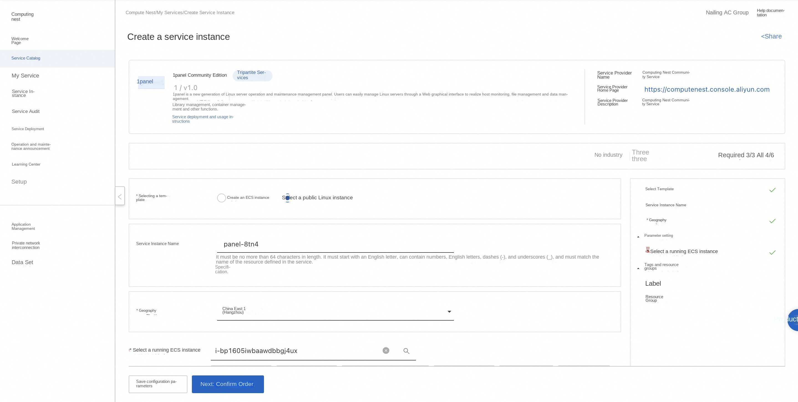
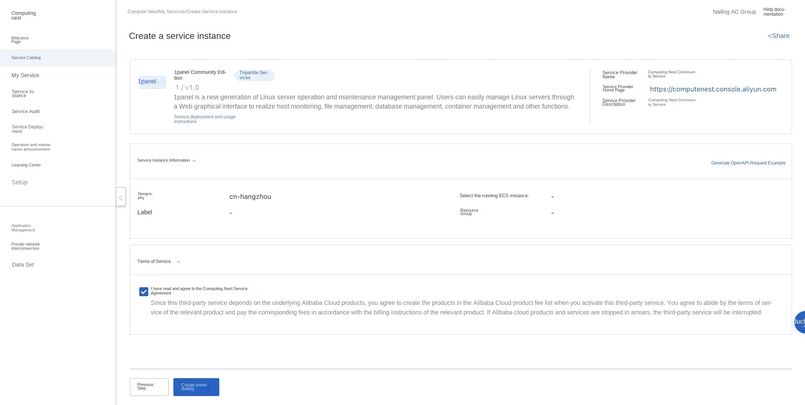
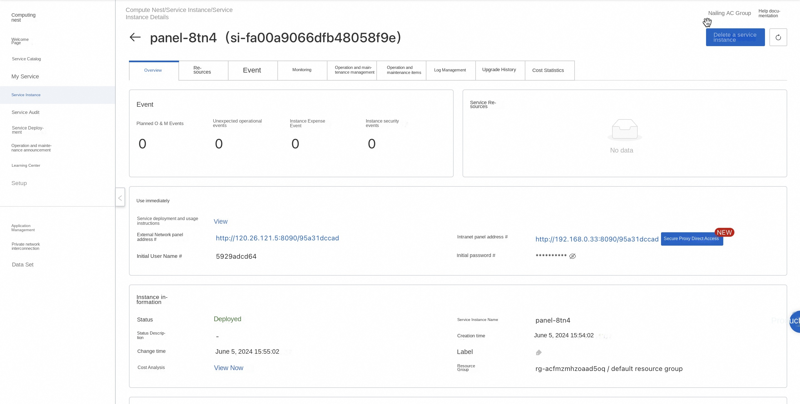
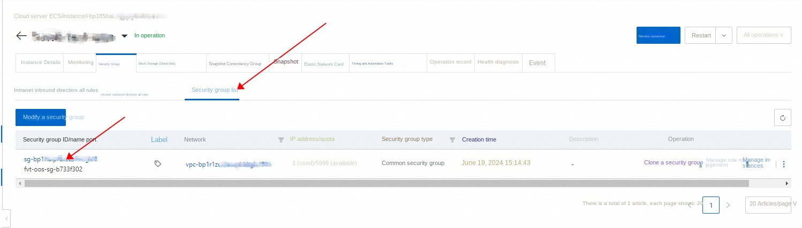
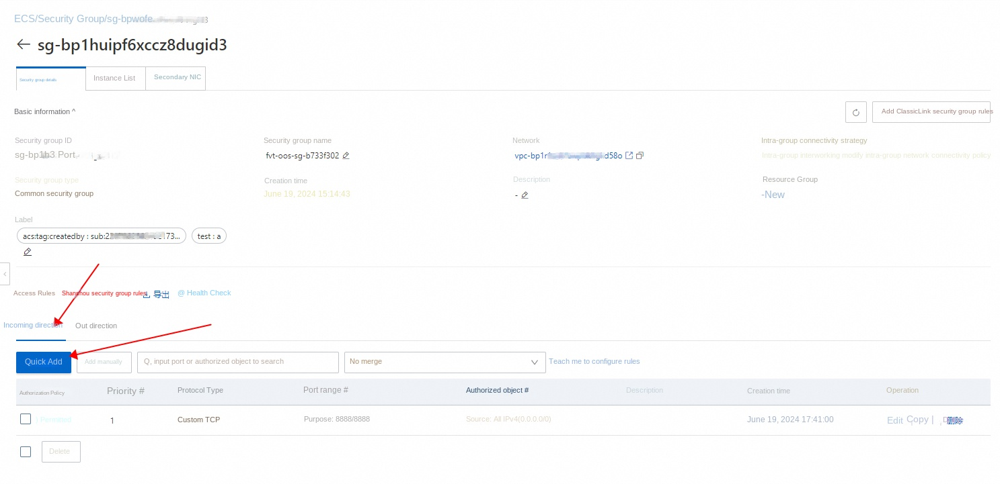
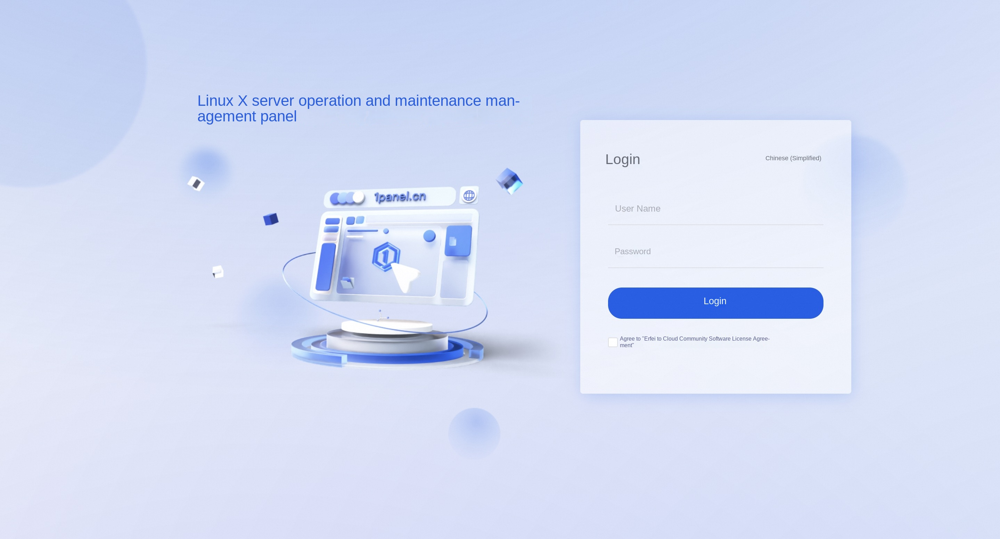
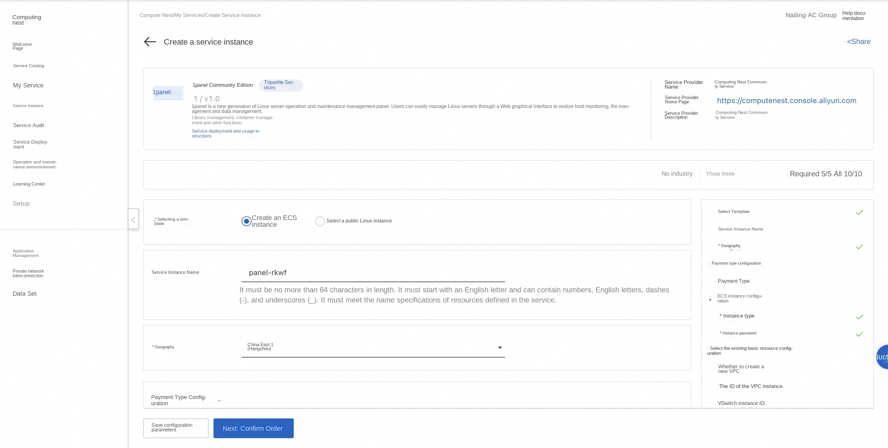
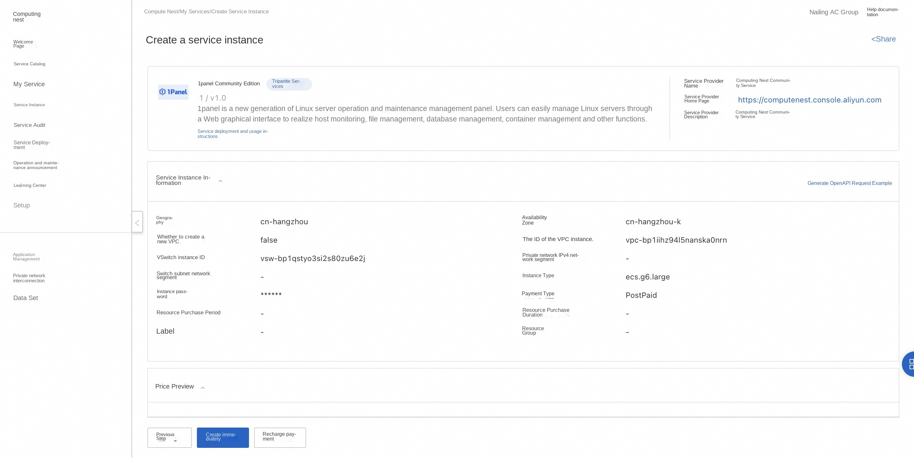

# Quickly deploy 1Panel operation and maintenance panel

## Overview

1Panel is a new generation of Linux server operation and maintenance management panel. Users can easily manage Linux servers through a Web graphical interface, realizing host monitoring, file management, database management, container management and other functions.

1Panel Official website:[https://www.fit2cloud.com/1panel/index.html](https://www.fit2cloud.com/1panel/index.html)

## Billing Description

The cost of the 1Panel panel on the calculation nest is mainly related:

-Selected vCPU and memory specifications
-Disk Capacity
-public network bandwidth

Billing method: Pay-As-You-Go (hourly)

The estimated cost can be seen in real time when the instance is created.

## Deployment Architecture

1Panel Panel Community Edition is a stand-alone deployment architecture.

## Permissions required for RAM accounts

The 1Panel service needs to access and create resources such as ECS and VPC. If you use a RAM user to create a service instance, you need to add the corresponding resource permissions to the account of the RAM user before creating the service instance. For details about how to add RAM permissions, see [Authorize RAM users](https://help.aliyun.com/document_detail/121945.html)
. The required permissions are shown in the following table.

| Permission policy name | Comment |
| ------------------------------------- | ------------------------ |
| AliyunECSFullAccess | Permissions for managing ECS instances |
| AliyunVPCFullAccess | Permissions for managing a VPC |
| AliyunROSFullAccess | Manage permissions for Resource Orchestration Service (ROS) |
| AliyunComputeNestUserFullAccess | Manage user-side permissions for the compute nest service (ComputeNest) |
| AliyunCloudMonitorFullAccess | Permissions to manage CloudMonitor (CloudMonitor) |

## Select ECS instance deployment
### Prerequisites
1. The ECS instance can access the public network
2. Operating system: Support mainstream Linux distributions (based on Debian / RedHat, including domestic operating systems)
3. Server Architecture: x86_64
4. Memory Requirements: It is recommended to have more than 1GB of available memory.
5. Browser Requirements: Please use Chrome, FireFox, IE10, Edge and other modern browsers
6. After the deployment is completed, you need to open the port in the security group to access the 1Panel panel.
### Operation steps
1. Click [Deployment Link](https://computenest.console.aliyun.com/service/instance/create/cn-hangzhou?type=user&ServiceId=service-4b2eae361ae8493d851a) to enter the service instance deployment interface.
2. Select the target ECS instance and click Next: Confirm Order.

3. Click Create Now and wait for the service instance to be created.

4. After the service instance is successfully created, go to the service instance details page. The login information of 1Panel panel can be obtained on the overview page, and the port used by 1Panel can be seen from the link.

5. Before accessing the panel, you need to open ports in the security group of the ECS instance. Find the security group on the ECS instance details page and add the port release rule in the inbound direction.

6. Click the address of the external network panel on the service instance details page and log in to the 1Panel panel.

## New ECS instance deployment

1. Click [Deployment Link](https://computenest.console.aliyun.com/service/instance/create/cn-hangzhou?type=user&ServiceId=service-4b2eae361ae8493d851a) to enter the service instance deployment interface.
2. Select the new ECS instance and configure the parameters according to the interface prompts. After the configuration is completed, click Next: Confirm Order.

3. Click Create Now and wait for the service instance to be created.

4. After the service instance is successfully created, go to the service instance details page. On the overview page, you can obtain the login information of the 1Panel panel. Click the address of the external network panel to log in to the 1Panel panel.

