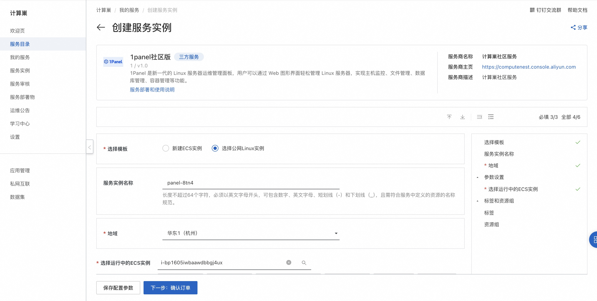
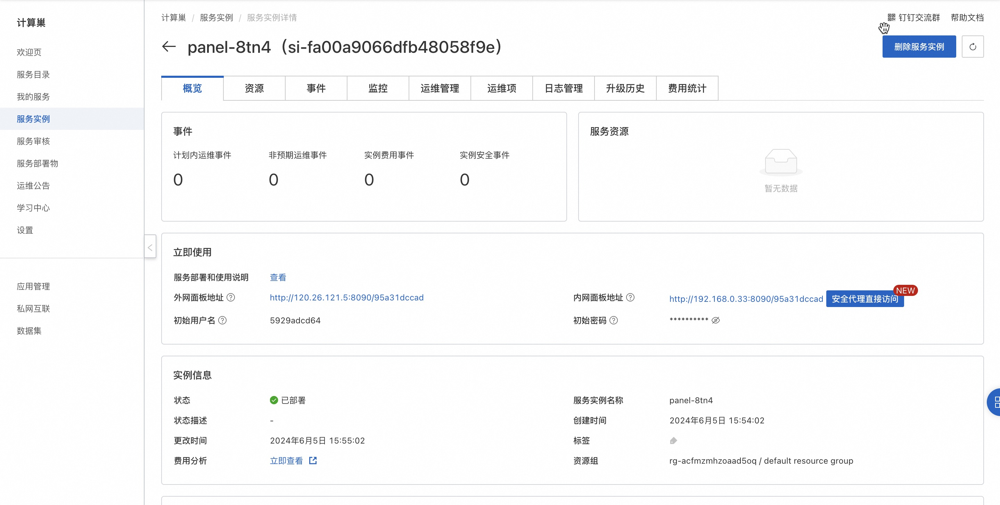
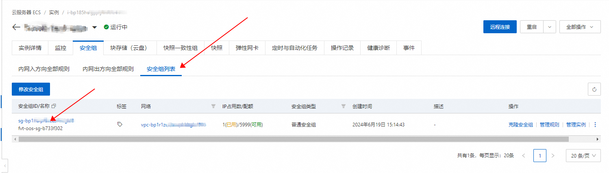

<h1> Quickly deploy the 1Panel operations panel </h1>

<h2> Overview </h2>

1Panel is a new generation of Linux server operation and maintenance management panel. Users can easily manage Linux servers through a Web graphical interface to realize host monitoring, file management, database management, container management and other functions. 

1Panel Official website:<a href = "https://www.fit2cloud.com/1panel/index.html">https://www.fit2cloud.com/1panel/index.html</a>

<h2> Billing instructions </h2>

 The cost of the 1Panel panel on the calculation nest mainly involves:

<ul>
<li> Selected vCPU and Memory Specifications </li>
<li> Disk capacity </li>
<li> Internet bandwidth </li>
</ul>

 Billing method: Pay-As-You-Go (hourly)

 The estimated cost is visible in real time when the instance is created. 

<h2> Deployment Architecture </h2>

1Panel Community Edition is a stand-alone deployment architecture. 

<h2> Permissions required for RAM accounts </h2>

1Panel services need to access and create resources such as ECS and VPC. If you use a RAM user to create a service instance, you need to add the corresponding resource permissions to the account of the RAM user before creating the service instance. For more information about how to add RAM permissions, see <a href = "https://help.aliyun.com/document_detail/121945.html"> Authorize RAM users </a>.
. The required permissions are shown in the following table. 

<table>
<thead>
<tr>
<th> Permission policy name </th>
<th> Remarks </th>
</tr>
</thead>
<tbody>
<tr>
<td>AliyunECSFullAccess</td>
<td> Permissions to manage ECS </td>
</tr>
<tr>
<td>AliyunVPCFullAccess</td>
<td> Permissions for managing VPC networks </td>
</tr>
<tr>
<td>AliyunROSFullAccess</td>
<td> Manage permissions for Resource Orchestration Services (ROS) </td>
</tr>
<tr>
<td>AliyunComputeNestUserFullAccess</td>
<td> Manage user-side permissions for the compute nest service (ComputeNest) </td>
</tr>
<tr>
<td>AliyunCloudMonitorFullAccess</td>
<td> Permissions to manage CloudMonitor (CloudMonitor) </td>
</tr>
</tbody>
</table>

<h2> Select ECS instance deployment </h2>

<h3> Prerequisites </h3>

<ol>
<li>ECS instances can access the Internet </li>
<li> Operating system: Supports mainstream Linux distributions (based on Debian / RedHat, including domestic operating systems)</li>
<li> Server architecture: x86_64</li>
<li> Memory requirement: It is recommended to have more than 1GB of available memory </li>
<li> Browser requirements: Use modern browsers like Chrome, FireFox, IE10, Edge, etc. </li>
<li>
 After the deployment is completed, you need to open the port in the security group to access the 1Panel panel 

<h3> Operation steps </h3></li>
<li>
 Click <a href = "https://computenest.console.aliyun.com/service/instance/create/cn-hangzhou?type=user&ServiceId=service-4b2eae361ae8493d851a"> Deployment Link </a> to enter the service instance deployment page. 
</li>
<li>
 Select the target ECS instance and click Next: Confirm Order. 

</li>
<li>
 Click Create Now and wait for the service instance to be created. 

</li>
<li>
 After the service instance is successfully created, go to the service instance details page. The login information of 1Panel panel can be obtained on the overview page, and the port used by 1Panel can be seen from the link. 

</li>
<li>
 Before accessing the panel, you need to open ports in the security group of the ECS instance. Find the security group on the ECS instance details page and add the port release rule in the inbound direction. 

</li>
<li>
 click the external network panel address on the service instance details page and log on to the 1Panel panel. 

</li>
</ol>

<h2> Create ECS instance deployment </h2>

<ol>
<li> Click <a href = "https://computenest.console.aliyun.com/service/instance/create/cn-hangzhou?type=user&ServiceId=service-4b2eae361ae8493d851a"> Deployment Link </a> to go to the Service Instance Deployment page. </li>
<li>
 Select the new ECS instance and configure the parameters according to the interface prompts. After the configuration is complete, click Next: Confirm Order. 

</li>
<li>
 Click Create Now and wait for the service instance to be created. 

</li>
<li>
 After the service instance is successfully created, go to the service instance details page. On the overview page, you can obtain the login information of the 1Panel panel. Click the address of the external network panel to log in to the 1Panel panel. 

</li>
</ol>
