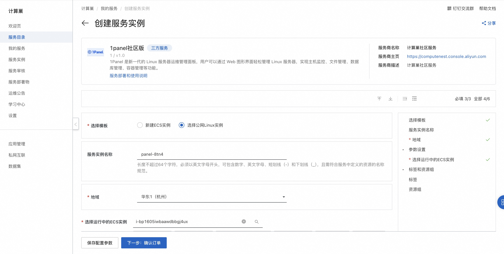
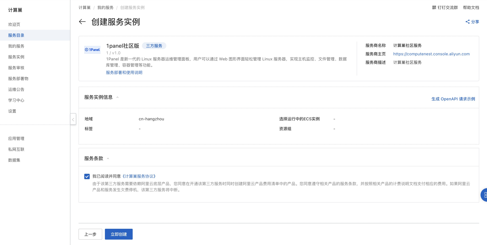
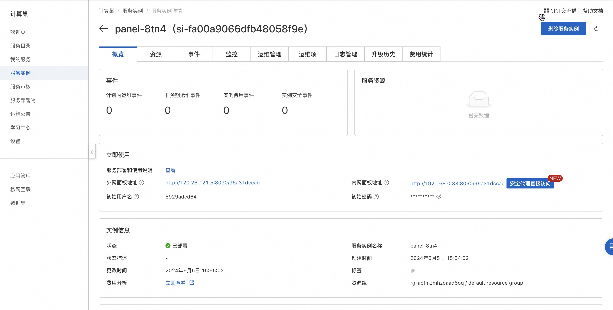
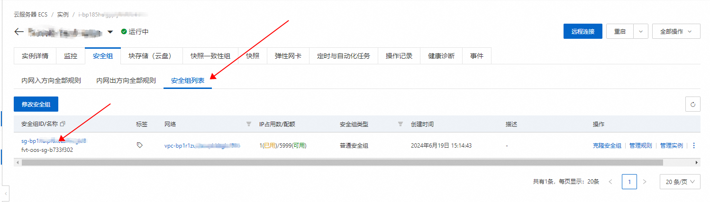
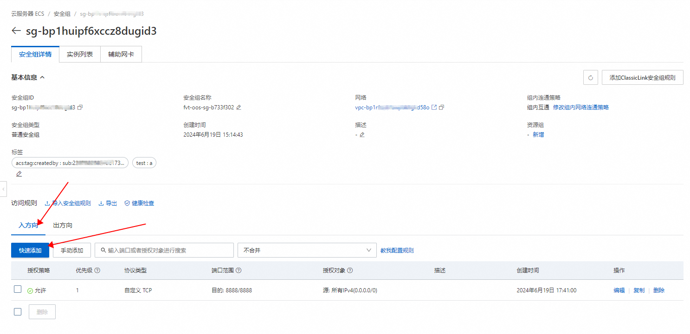
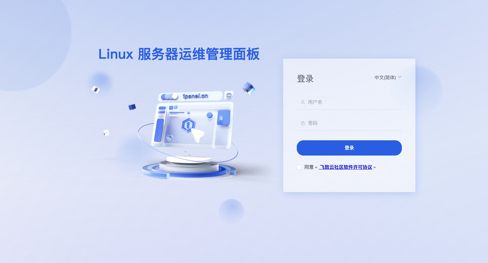
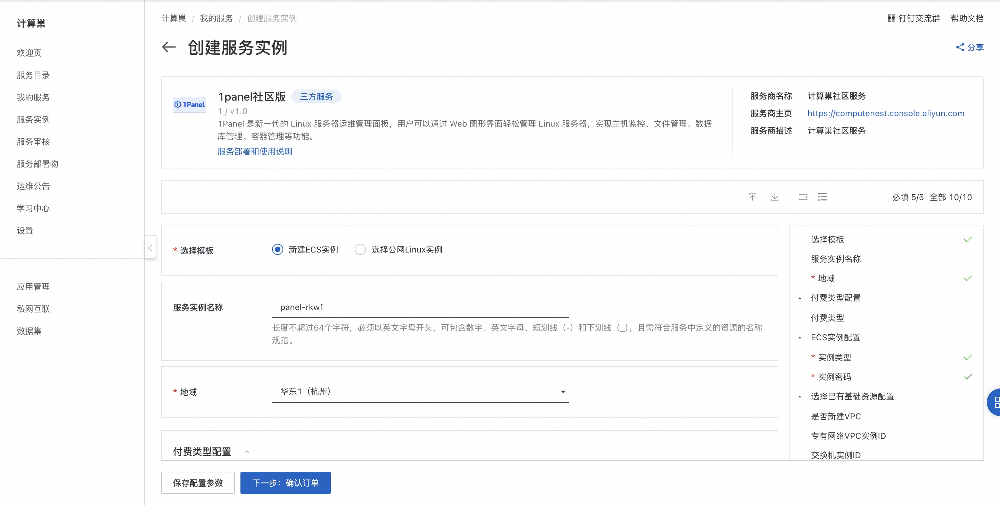
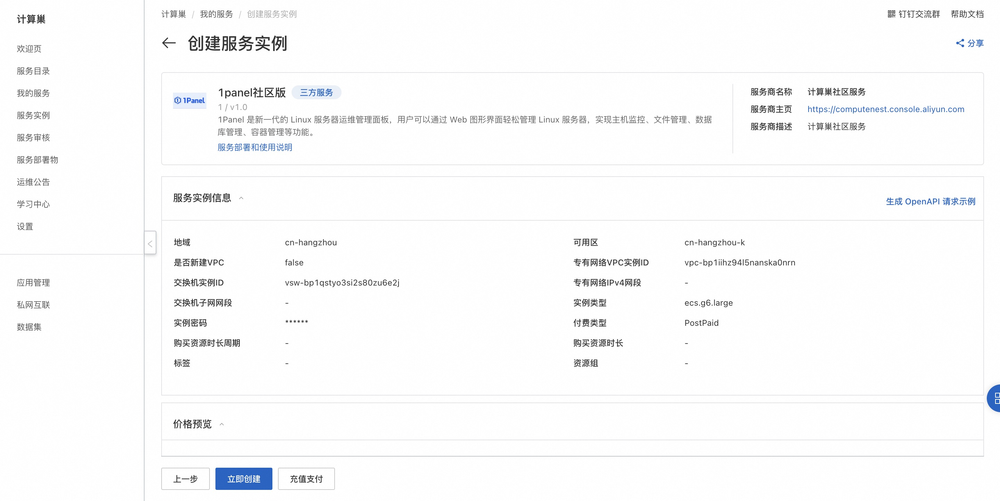

# 快速部署1Panel运维面板

## 概述

1Panel 是新一代的 Linux 服务器运维管理面板，用户可以通过 Web 图形界面轻松管理 Linux 服务器，实现主机监控、文件管理、数据库管理、容器管理等功能。

1Panel面板官方网站：[https://www.fit2cloud.com/1panel/index.html](https://www.fit2cloud.com/1panel/index.html)

## 计费说明

1Panel面板在计算巢上的费用主要涉及：

- 所选vCPU与内存规格
- 磁盘容量
- 公网带宽

计费方式：按量付费（小时）

预估费用在创建实例时可实时看到。

## 部署架构

1Panel面板社区版是单机部署架构。

## RAM账号所需权限

1Panel面板服务需要对ECS、VPC等资源进行访问和创建操作，若您使用RAM用户创建服务实例，需要在创建服务实例前，对使用的RAM用户的账号添加相应资源的权限。添加RAM权限的详细操作，请参见[为RAM用户授权](https://help.aliyun.com/document_detail/121945.html)
。所需权限如下表所示。

| 权限策略名称                          | 备注                         |
|---------------------------------|----------------------------|
| AliyunECSFullAccess             | 管理云服务器服务（ECS）的权限           |
| AliyunVPCFullAccess             | 管理专有网络（VPC）的权限             |
| AliyunROSFullAccess             | 管理资源编排服务（ROS）的权限           |
| AliyunComputeNestUserFullAccess | 管理计算巢服务（ComputeNest）的用户侧权限 |
| AliyunCloudMonitorFullAccess    | 管理云监控（CloudMonitor）的权限     |

## 选择ECS实例部署
### 前提条件
1. ECS实例可以访问公网
2. 操作系统：支持主流 Linux 发行版本（基于 Debian / RedHat，包括国产操作系统）
3. 服务器架构：x86_64
4. 内存要求：建议可用内存在 1GB 以上
5. 浏览器要求：请使用 Chrome、FireFox、IE10+、Edge等现代浏览器
6. 部署完成后需要在安全组中开放端口才可以访问1Panel面板
### 操作步骤
1. 单击[部署链接](https://computenest.console.aliyun.com/service/instance/create/cn-hangzhou?type=user&ServiceId=service-4b2eae361ae8493d851a)，进入服务实例部署界面。
2. 选择目标ECS实例，点击下一步：确认订单。

    
   
3. 点击立即创建，等待服务实例创建完成。

   

4. 服务实例创建成功后，进入服务实例详情页。在概览页可获取1Panel面板登录信息，从链接上可以看到1Panel使用的端口。 
   
   

5. 在访问面板之前，需要在ECS实例的安全组中开放端口。从ECS实例详情页找到安全组，添加入方向的端口放行规则。

   

   

6. 在服务实例详情页点击外网面板地址，登录1Panel面板。
   
   

## 新建ECS实例部署

1. 单击[部署链接](https://computenest.console.aliyun.com/service/instance/create/cn-hangzhou?type=user&ServiceId=service-4b2eae361ae8493d851a)，进入服务实例部署界面。
2. 选择新建ECS实例并根据界面提示配置参数，配置完成后点击下一步：确认订单。

    
   
3. 点击立即创建，等待服务实例创建完成。

   

4. 服务实例创建成功后，进入服务实例详情页。在概览页可获取1Panel面板登录信息，点击外网面板地址，登录1Panel面板。
   
   
